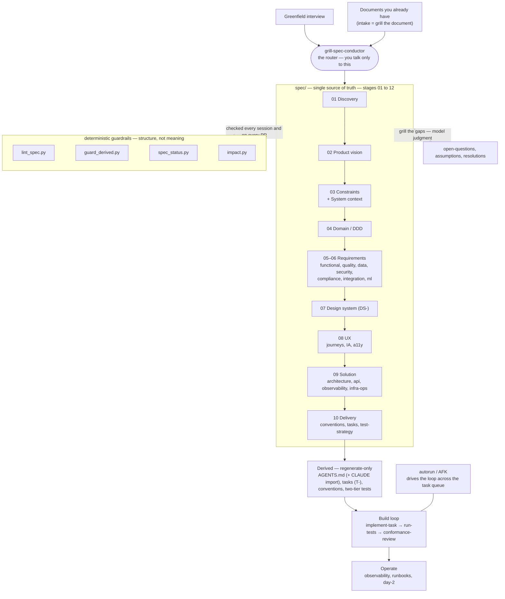

# How it works

A short guide to what this system is, how you drive it, and what each background tool does.

## In one paragraph

You describe what you want to build. The system **interviews you** — or **ingests documents you already have** — pressure-tests every answer, and writes a rigorous, cross-referenced **specification** under `spec/`. From that spec it **derives** what an agent needs to build: coding conventions, a task list, a test strategy, and a canonical `AGENTS.md` entry point (with an import-only `CLAUDE.md` adapter). Then it **drives the coding**, task by task, checking each change against the spec and the architecture. Deterministic tools enforce the structure; the hard thinking — *is this requirement right? is this document actually complete?* — is the model's job, done through a set of interview "lenses."

## The one thing to know

You talk to a single skill: **`grill-spec-conductor`** (the conductor). It is the front door and the router. You never call the other skills by hand — the conductor reads the state of the spec and tells you the next sensible move. Start every session by invoking it in your active host: `/grillspec:grill-spec-conductor` in Claude Code or `$grillspec:grill-spec-conductor` in Codex.

## The shape of it

Solid arrows are the build flow. The two dotted backstops are the point of the whole system: deterministic guardrails that check **structure**, and the grilling lenses that resolve **meaning**.

## The pipeline, stage by stage

Each stage takes the stage(s) before it as input and produces the artifacts the next stage depends on. The conductor routes; each stage is one — or a few — concrete skills.

| Stage | Skill(s) | Takes in | Produces |
|---|---|---|---|
| 01 Discovery | `grill-problem-validation` | the idea / the bet | problem, riskiest bets, assumptions, PMF plan |
| 02 Product | `grill-product-vision` · `grill-customer-discovery` · `grill-market` · `grill-goals` | discovery | vision & phasing (MVP / near / deferred), **the GTM motion (PLG vs sales-led)**, personas, market, success metrics |
| 03 Constraints | `grill-constraints` | the idea / existing docs | technical · organizational · regulatory bounds, assumptions, dependencies |
| 03 System context | `grill-system-context` | product + constraints | external actors, neighbor systems, interfaces, the C4 System Context (L1) |
| 04 Domain (DDD) | `grill-ddd` | vision + system context | aggregates, commands, events, invariants, ubiquitous language |
| 05–06 Requirements | `derive-functional` · `grill-quality` · `grill-data-reqs` · `grill-security-reqs` · `grill-compliance` · `grill-integration-reqs` · `grill-entitlements` · `grill-ml-reqs` (AI) | domain | use-cases + acceptance criteria (`UC-`/`AC-`), quality bars (`NFR-`/`ASR-`), data (`DATA-`), security (`SEC-`), obligations (`OBL-`), integration, entitlements (`ENTL-`), ML behaviour/evals (`ML-`, AI) |
| 07 Design system | `grill-design-system` | requirements | tokens (DTCG), components, a11y, brand, voice — the `DS-` contract over the design-system asset (its **own layer**) |
| 08 UX | `grill-ux-reqs` | design-system + requirements | user journeys, information architecture, a11y/i18n + usability targets (no ids — a **synthesis** of the design system and the requirements) |
| 11 Commercial | `grill-monetization` | entitlements + product vision | business model · pricing · plans · **prices the `ENTL-` tiers** · metering — **feeds 09 Solution** (entitlement enforcement, billing, metering become build work) |
| 09 Solution | `derive-architecture` · `derive-data-architecture` · `derive-api-contracts` · `derive-security-architecture` · `derive-infra-ops` · `derive-observability` · `derive-test-strategy` · `derive-ml-architecture` (AI) | requirements | architecture incl. the **module map & seam contracts** + key sequences, API / event contracts (`API-`), observability (`SLO-`), deployment & ops, the two-tier test strategy, ML serving / eval / guardrails (AI) — *module internals are designed per-slice in Build, not here* |
| 10 Delivery | `derive-conventions` · `derive-tasks` | solution | canonical `AGENTS.md` + `CLAUDE.md` import, the task list (`T-`), coding conventions |
| Build | `implement-task` · `run-tests` · `conformance-review`  (· `autorun` drives it AFK; a **design-first** slice first runs `derive-impl-design` for its module internals; a ux-heavy slice already carries its **frozen UI prototype** from task finalization) | delivery | working code, one slice at a time: (design-first → module internals) → implement → test → conformance-review |
| Build Docs | `generate-docs` · `generate-api-reference` | the spec (any change) | a self-contained docs site (HTML) — **continuous: rebuilt in CI on every spec change**, not a one-time slot |
| Operate | `deploy-release` · `migrate-data` · `operate-incident` · `diagnose` | the running system | deploys, migrations, incident & diagnosis records, day-2 cadence |

**Parallel & cross-cutting:**

- **Go-to-market** (`grill-go-to-market`, 11-commercial) — channels · per-channel messaging · launch · partnerships: genuinely commercial *execution*. The build-shaping decision — the **motion** (PLG vs sales-led) — was lifted up into the **product vision** (02), where it feeds onboarding (UX), auth/SSO (security), and billing (monetization). A marketplace channel or a partnership can still surface an integration requirement.
- **Growth** (`grill-growth`, 11-commercial) — post-launch activation/retention + experiments; the **analytics events it defines become instrumentation tasks** in the build, so it loops back in.
- **Spikes** (`prototype`) — runnable at **any stage** to settle one empirical unknown (feasibility · perf · a UX direction), then deleted; the answer lands as a bet, a requirement, or an ADR.

## Two ways in

- **Greenfield** — the conductor interviews you area by area. Vague answers become measurable bars; every edge, error, and state is hunted down before an area is "done."
- **You already have documents** — *intake is grilling, with the document as the interviewee.* The system files your content into the right places **and** runs the same interrogation. A document that parses cleanly is not "done": every coverage gap, vague assertion, ambiguous term, open branch, and contradiction is surfaced — **silence is an unanswered question; a confident sentence is an unvalidated assumption.** Each finding is **recorded in the artifact it belongs to** — resolved, or deferred there with the trigger that reopens it — and grilled like any interview answer. See `conductor-playbook.md` for the two intake modes (single doc-first start, and migrate mode for a whole pile of docs).

## The background tools — what does what, and when

| Tool | What it does | When it runs | Verdict |
|---|---|---|---|
| `lint_spec.py` | Formal structure, consistency, and coverage: valid file paths, defined IDs, resolving references, one definition per ID, per-area ID ownership, correlated & derived→driver IDs (`AC-`→`UC-`, `ASR-`→`NFR-`, `JRN-`→`UC-`, `SLO-`→`NFR-`, `ML-`→`UC-`), coverage hints, traceability currency, superseded-ADR-referenced-as-live, and blocked-task-without-a-human-ask | Every session, and on every pull request (`spec-governance.yml`) | Deterministic pass/fail — an `ERROR` blocks |
| `guard_derived.py` | A pre-commit hook that **blocks hand-edits to generated files** (`solution/*`, `functional-spec/`, `delivery/conventions`+`tasks/`, canonical root `AGENTS.md`, import-only `CLAUDE.md`). To change one, you edit its upstream and re-derive | Pre-commit, and in CI | Blocks the commit |
| `impact.py` | **Change propagation.** Given the IDs you changed — or `--since <gitref>` to self-detect from the git diff — it prints the minimal set of downstream artifacts and the impacted code to re-derive and re-test | Whenever you change the spec | Informational list |
| `spec_status.py` | **Mechanical readiness rollup.** Element counts, the share of use-cases that carry an acceptance criterion, tasks (afk-eligible vs blocked), open questions, traceability presence, and a blockers verdict | Run anytime to gauge completeness | Informational only — it does **not** judge whether the content is right |

A second family of tools enforces **accountability during build** — that code is actually built the way the spec demands, not just claimed to be:

| Tool | What it does | When it runs | Verdict |
|---|---|---|---|
| `check_task_record.py` | The per-task **Verification Record**: `--init` generates a task's obligation checklist from its *frozen* spec references (legacy field list or current two-column manifest; the bar can't be shrunk); the default check fails a task that *claims* done but left an obligation unmet, dropped one, **omitted any standard gate row** (`tests-first`/`tests:layers`/`coverage`/`mutation`/`fitness:*`/`spec-lint`/`deploy`/`traceability` — a silently-dropped artifact or check), has no independent `VERDICT: PASS` on disk, a task-declared `AC-` with no literal `@covers` tag in a failing-capable test source, a fabricated evidence path, or coverage below its bar; `--report` renders a readable, tool-vouched ✅ completion report | Task start (`--init`), at done, pre-merge | Blocks a done-claim that isn't backed |
| `check_no_fakes.py` | A cross-language **tripwire** against non-production code in `src/`: a `Fake*/Stub*/Mock*/Dummy*` definition or a mocking-library import is an ERROR; an `unconfigured→fallback`/placeholder body is a WARN. The belt to the per-language no-fakes fitness function's suspenders | Code pre-commit + CI | ERROR blocks |
| `check_deploy_real.py` | The deploy-side sibling of `check_no_fakes.py`: a **tripwire against a faked/skipped deploy** across the CI/deploy artifacts (GitHub/GitLab/Circle/Azure/Bitbucket/Drone/Cloud-Build/Jenkins configs · shell deploy scripts · Dockerfiles · `package.json`/`Makefile` deploy targets) — a `# TODO`/placeholder is an ERROR; a disabled (`if: false`) deploy or a deploy-intent artifact that invokes no recognized deploy command is a WARN. The static backstop for the early window before an e2e/smoke against the real deployed env can run (that behavioural run is the authoritative proof) | Code pre-commit + CI | ERROR blocks |
| `check_migration_real.py` | A **tripwire against a faked/empty schema migration** (files under a migration home): a `-- TODO`/placeholder is an ERROR; a DDL-less `.sql`, an empty `operations = []`, or a `pass`-only migration is a WARN. Makes "the migration that exists actually migrates" mechanical, beside the conformance review's "a schema change has a migration at all" | Code pre-commit + CI | ERROR blocks |
| `check_config_drift.py` | Reconciles the env vars the **code reads** against the **declared** `infra-ops/environments.md` matrix — a key the code reads but the matrix doesn't declare is the classic "missing env var in prod" outage, caught at commit instead | Code pre-commit + CI | ERROR blocks |
| `check_mock_budget.py` | A **tripwire against over-mocking** — reads the tier contract in `test/levels.md` and enforces each tier's `mock-ceiling`: a mock at a `none` tier (unit/contract/e2e) or a mock of a real dependency at a `boundary-only` (integration) tier is an ERROR. The complement to `check_no_fakes.py` (which never scans `tests/`): that catches fakes leaking *into* `src/`, this catches tests that fake *what they should exercise for real* | Code pre-commit + CI · read by `audit-build` | ERROR blocks |
| `check_test_tiers.py` | Reconciles the **declared tier contract vs the actual test tree**: a tier the strategy declares but that has no suite is an ERROR; a test filed under a tier the contract never declares is a WARN. Also prints the per-tier distribution (the numbers `audit-build`'s pyramid-vs-declared judgment needs) | Code pre-commit + CI · read by `audit-build` | ERROR blocks |
| `check_e2e_target.py` | A **tripwire against an "e2e" that runs on a local stack** — for tiers whose `target-env` is not `local`, a test hard-referencing `localhost`/`docker-compose`/`testcontainers` is an ERROR (integration mislabelled as e2e; it never exercises the deploy). The mechanical half of "the deploy is behaviourally proven" | Code pre-commit + CI · read by `audit-build` | ERROR blocks |
| `check_no_skips.py` | A **tripwire against disabled/weakened tests** — a `skip`/`xfail`/`ignore` marker, a `.only`/`fit` suite-shrinker, or a CI/build file that swallows a red test run (`npm test || true`, gradle `ignoreFailures`) is an ERROR; a declared deferral (`it.todo`, `continue-on-error`) is a WARN, promoted to ERROR under `--strict` at release. The test-side complement of `check_no_fakes.py`: that catches a fake shipped in `src/`, this catches the green bought by not running the test at all — in this system an unready dependency keeps the test honestly red | Code pre-commit + CI · read by `audit-build` (`--strict`) | ERROR blocks |
| `check_operate_records.py` | **Reconciles the `12-operate/` ledger against the spec** it enacted: a record referencing a spec ID (`T-`/`DATA-`/`NFR-`/…) that resolves nowhere is an ERROR, as is a deploy to an env off the declared promotion path; a deploy naming no `T-` or a migration citing no `DATA-` is a WARN. The only checker for the append-only operate layer, which `guard_derived.py`/`check_freshness.py` don't cover | On demand · read by `audit-build` | ERROR blocks |
| `check_release_attestation.py` | The **opt-in release gate**: a `build-audit-report.md` must exist and read `BUILD ATTESTATION: ATTESTED` (not `NOT-ATTESTED`/`NOT-ATTESTABLE`, and not missing). Also checks it's a `--deep` pass (`--require-deep`) and **still covers HEAD** — a `commit:` stamp that HEAD has moved past is a STALE attestation and blocks (`--require-fresh` also blocks an unverifiable one). Makes the whole-build audit's verdict a hard gate, symmetric to how `check_task_record.py` gates the per-task conformance verdict — ships available, wired-on only if the team makes it a required release check | Release time (opt-in) | ERROR blocks the release |
| `gate_exec.py` | The project-local **PreToolUse exec-gate** — the only enforcer that runs *at tool-call time*, where the per-task build **order** is visible (a commit-time check can't see it). Blocks a `src/**` edit until a real failing-test run was recorded for the active task (red-before-green; `--red` re-runs the command and refuses unless it fails), blocks flipping a record to `status: done` until `check_task_record.py --assume-done` passes, and denies an edit that introduces a skip/xfail/`.only` into a test file or a mock-import/`Fake*` double into `src/` — that third gate is task-independent, so it covers setup/bootstrap work before any task branch exists. Armed at exec-session entry (the engine's step zero) and committed by the walking-skeleton (`install_exec_gates.py`, idempotent), project-local like the git pre-commit hook. Fail-open on internal error; no-ops outside an exec loop | **Tool-call time** (PreToolUse), live during the build loop | Blocks the edit (override: `GRILLSPEC_GATE_OFF=1`) |

Together they close the loop the dev side needs (tests-first, no fakes, every obligation evidenced) and the ops side needs (the config the operator provisions against is complete), with a `preflight`/`doctor` command + `/healthz`·`/readyz` endpoints the conventions mandate so an operator can *verify* an environment meets the code's needs before serving traffic.

Behind the skills sit three shared engines: `grill-engine.md` (the interview discipline every `grill-*` skill loads), `derive-engine.md` (the generation discipline every `derive-*` skill loads), and `exec-engine.md` (the build/verify discipline every execution skill loads). The walking-skeleton task and the derive-* skills **generate three GitHub Actions into your project**, ready to run: `spec-governance.yml` (the framework's `lint_spec.py` + `guard_derived.py` on PRs), `code-ci.yml` (the application's own build / test / conformance pipeline), and `docs-site.yml` (the generated documentation site). They are produced into your repo, not shipped as files in this plugin.

## Deterministic vs. model judgment — read this once

The tools enforce **structure**. They cannot tell you whether a requirement is *correct*, whether a document is *actually complete*, or whether two sentences *mean* the same thing — that is model judgment, done by the grilling lenses. **A clean linter on a spec nobody interrogated means nothing.** Both layers are load-bearing: structure keeps the spec well-formed, the lenses keep it true.

## Where things live

- `spec/` — the specification, stage-numbered `01-discovery` … `12-operate`. The single source of truth.
- `adr/` — every Architecture Decision Record, **one file per ADR**, named `ADR-<AREA>-NNN.md` (the area prefix stops two skills colliding); the conductor derives a global ADR index from it.
- **No side-ledger files** — there is no `open-questions.md`, `assumptions.md`, or `resolutions.md`. An open point is resolved into its artifact, **deferred in the artifact** with the trigger that reopens it, or — if it's a deliberate choice — captured as an ADR. `glossary.md` and `actors.md` are **per-area deliverables**; the conductor reconciles a system-wide view at the spec root.
- `_human-input.md` (spec root) — the **one operational queue**: the batched human-in-the-loop asks `autorun` parks for you to clear in a sitting. Maintained by the orchestration loop; it's a handoff queue, not a decision ledger.
- `spec/12-operate/` — the **operations ledger**: append-only records of what actually happened to the running system, not derived from the spec and never regenerated. **First created during Build, by `implement-task` on the walking-skeleton task** (the first build task, typically `T-001`), which writes **`bootstrap.md`** — not a bare checklist but a phased, per-platform, per-environment **setup runbook** composed from the infra-ops design (`environments.md`, the config matrix · `prerequisites.md`, the per-platform provisioning steps · `runtime-contract.md`, what the artifact needs to run): Phase A initial (local + dev, the env-var worksheet), Phase B production/pre-launch and Phase C day-2 (filled by `deploy-release`, which also gates the first prod push behind a `production-readiness.md` review). Its unchecked items are what gate the walking skeleton's *true* done-state: the agent infers "bootstrap hasn't run" structurally (on a first run the file is an output it's about to create), and the external facts it lists — actual provisioning, branch-protection rules — live in third-party dashboards the agent can't observe, so it asks you to confirm rather than asserting. From then on the folder accumulates one record per real operational event: `deploy-<env>-<version>.md` (`deploy-release`), `incident-<id>.md` (`operate-incident`), `diagnosis-<id>.md` (`diagnose`), `migration-<DATA|AGG-id>.md` (`migrate-data`). The ADRs those skills emit (`ADR-REL-`, `ADR-INC-`, …) go to the shared `adr/` folder, not here.
- `src/` + `tests/` — code, and nothing else.
- **Regenerate-only** (never hand-edited; the guard blocks it): `solution/*`, `functional-spec/`, `delivery/conventions`+`tasks/`, canonical root `AGENTS.md`, and its import-only `CLAUDE.md` adapter.

## Driving it — the loop

1. Run the conductor. It reports where the spec stands and the next move.
2. Answer its questions, or ratify the default it proposes. It records as it goes and **propagates** every change automatically.
3. An unknown is **resolved into its artifact or deferred there** (with the trigger that reopens it); a risky guess is recorded as an **assumption with a status, beside what it supports** — or an ADR if load-bearing. Nothing is silently assumed, and there is no separate ledger file.
4. When the spec is ready it derives conventions, tasks, and tests, then drives the build: `implement-task → run-tests → conformance-review`, one task at a time.
5. **AFK / autorun** runs that loop across the whole task queue on its own, stopping only on a true human-in-the-loop trigger: a visual / UX call, a product or strategy decision, a legal sign-off, an external credential, or an irreducible preference fork.
