<!-- scope: the system's static skill-dependency graph | excludes: a project's runtime ID-reference graph (that is impact.py) | format: generated -->
# Dependency graph — what each area consumes & produces

**Generated from `grill-shared/dependencies.json` by `tools/gen_depgraph.py` — do not hand-edit.**
The conductor reads the JSON to know, before running an area's skill, which upstream artifacts/IDs to gather and hand it. `Consumes` = the upstream areas it builds from; `Produces` = the stable-ID prefixes it mints.

| Area | Skill | Kind | Consumes (upstream) | Produces (IDs) |
|---|---|---|---|---|
| **0 · Discovery** | | | | |
| `problem-validation` | grill-problem-validation | elicit | — | — |
| **0 · Foundation** | | | | |
| `constraints` | grill-constraints | elicit | — | — |
| `customer-discovery` | grill-customer-discovery | elicit | product-vision | — |
| `goals` | grill-goals | elicit | product-vision | — |
| `market` | grill-market | elicit | product-vision | — |
| `product-vision` | grill-product-vision | elicit | problem-validation | CA- |
| `system-context` | grill-system-context | elicit | customer-discovery, constraints | IF- |
| **1 · Domain** | | | | |
| `ddd` | grill-ddd | model | product-vision, constraints, system-context | CMD-, EVT-, AGG-, VO-, ENT-, POL-, RM-, HOT-, SVC-, REPO-, FAC- |
| **2 · Requirements** | | | | |
| `compliance` | grill-compliance | elicit | constraints | OBL- |
| `data-reqs` | grill-data-reqs | derive | ddd | DATA- |
| `derive-functional` | derive-functional | derive | ddd | UC-, AC- |
| `entitlements` | grill-entitlements | derive | derive-functional | ENTL- |
| `integration-reqs` | grill-integration-reqs | elicit | system-context, ddd | — |
| `ml-reqs` | grill-ml-reqs | elicit | derive-functional, data-reqs | ML- |
| `quality` | grill-quality | derive | ddd | NFR-, ASR- |
| `security-reqs` | grill-security-reqs | derive | data-reqs, ddd, product-vision | SEC-, THR- |
| **3 · Design system** | | | | |
| `design-system` | grill-design-system | elicit | quality | DS- |
| **4 · UX** | | | | |
| `ux-reqs` | grill-ux-reqs | derive | derive-functional, ddd, design-system, quality, product-vision | — |
| **5 · Solution** | | | | |
| `derive-api-contracts` | derive-api-contracts | derive | ddd, integration-reqs, security-reqs, derive-architecture | API- |
| `derive-architecture` | derive-architecture | derive | derive-functional, ddd, quality, data-reqs, integration-reqs, security-reqs, ux-reqs, compliance, ml-reqs, system-context, constraints, entitlements | MOD- |
| `derive-data-architecture` | derive-data-architecture | derive | data-reqs, ddd, derive-functional, derive-architecture | — |
| `derive-infra-ops` | derive-infra-ops | derive | quality, constraints, derive-architecture | — |
| `derive-ml-architecture` | derive-ml-architecture | derive | ml-reqs, derive-architecture, derive-data-architecture | — |
| `derive-observability` | derive-observability | derive | quality, security-reqs, derive-architecture | SLO- |
| `derive-security-architecture` | derive-security-architecture | derive | security-reqs, derive-architecture, derive-data-architecture | — |
| `derive-test-strategy` | derive-test-strategy | derive | derive-functional, ux-reqs, derive-architecture, quality, derive-api-contracts, derive-observability, security-reqs | — |
| **6 · Delivery prep** | | | | |
| `derive-conventions` | derive-conventions | derive | derive-architecture, derive-test-strategy | — |
| `derive-tasks` | derive-tasks | derive | derive-functional, ddd, derive-architecture, derive-conventions, product-vision, ux-reqs, derive-api-contracts | T- |
| **7 · Execution** | | | | |
| `autorun` | autorun | exec | derive-tasks | — |
| `conformance-review` | conformance-review | exec | derive-tasks, implement-task, derive-architecture, derive-api-contracts, derive-data-architecture, security-reqs, compliance, quality, derive-conventions, ddd | — |
| `derive-impl-design` | derive-impl-design | derive | derive-architecture, derive-tasks | — |
| `implement-task` | implement-task | exec | derive-tasks, derive-architecture, derive-conventions, derive-impl-design | — |
| `run-tests` | run-tests | exec | derive-tasks, implement-task | — |
| **8 · Operate** | | | | |
| `deploy-release` | deploy-release | exec | derive-infra-ops, derive-observability | — |
| `diagnose` | diagnose | exec | — | — |
| `migrate-data` | migrate-data | exec | data-reqs, derive-data-architecture | — |
| `operate-incident` | operate-incident | exec | derive-observability, derive-infra-ops | — |
| **post-launch · Commercial** | | | | |
| `go-to-market` | grill-go-to-market | elicit | product-vision | — |
| `growth` | grill-growth | elicit | goals, compliance, data-reqs | EXP- |
| `monetization` | grill-monetization | elicit | entitlements, product-vision, goals | — |
| **Any stage** | | | | |
| `generate-api-reference` | generate-api-reference | publish | derive-api-contracts | — |
| `generate-docs` | generate-docs | publish | conformance-review | — |
| `generate-ui-prototype` | generate-ui-prototype | publish | ux-reqs, design-system, derive-functional | — |
| `prototype` | prototype | validate | — | — |

## Diagram

```mermaid
flowchart TD
  subgraph stage_0_discovery["0 · Discovery"]
    problem_validation["problem-validation"]
  end
  subgraph stage_0_foundation["0 · Foundation"]
    constraints["constraints"]
    customer_discovery["customer-discovery"]
    goals["goals"]
    market["market"]
    product_vision["product-vision<br/>CA-"]
    system_context["system-context<br/>IF-"]
  end
  subgraph stage_1_domain["1 · Domain"]
    ddd["ddd<br/>CMD- EVT- AGG- VO- ENT- POL- RM- HOT- SVC- REPO- FAC-"]
  end
  subgraph stage_2_requirements["2 · Requirements"]
    compliance["compliance<br/>OBL-"]
    data_reqs["data-reqs<br/>DATA-"]
    derive_functional["derive-functional<br/>UC- AC-"]
    entitlements["entitlements<br/>ENTL-"]
    integration_reqs["integration-reqs"]
    ml_reqs["ml-reqs<br/>ML-"]
    quality["quality<br/>NFR- ASR-"]
    security_reqs["security-reqs<br/>SEC- THR-"]
  end
  subgraph stage_3_design_system["3 · Design system"]
    design_system["design-system<br/>DS-"]
  end
  subgraph stage_4_ux["4 · UX"]
    ux_reqs["ux-reqs"]
  end
  subgraph stage_5_solution["5 · Solution"]
    derive_api_contracts["derive-api-contracts<br/>API-"]
    derive_architecture["derive-architecture<br/>MOD-"]
    derive_data_architecture["derive-data-architecture"]
    derive_infra_ops["derive-infra-ops"]
    derive_ml_architecture["derive-ml-architecture"]
    derive_observability["derive-observability<br/>SLO-"]
    derive_security_architecture["derive-security-architecture"]
    derive_test_strategy["derive-test-strategy"]
  end
  subgraph stage_6_delivery_prep["6 · Delivery prep"]
    derive_conventions["derive-conventions"]
    derive_tasks["derive-tasks<br/>T-"]
  end
  subgraph stage_7_execution["7 · Execution"]
    autorun["autorun"]
    conformance_review["conformance-review"]
    derive_impl_design["derive-impl-design"]
    implement_task["implement-task"]
    run_tests["run-tests"]
  end
  subgraph stage_8_operate["8 · Operate"]
    deploy_release["deploy-release"]
    diagnose["diagnose"]
    migrate_data["migrate-data"]
    operate_incident["operate-incident"]
  end
  subgraph stage_9_commercial["post-launch · Commercial"]
    go_to_market["go-to-market"]
    growth["growth<br/>EXP-"]
    monetization["monetization"]
  end
  subgraph stage_any["Any stage"]
    generate_api_reference["generate-api-reference"]
    generate_docs["generate-docs"]
    generate_ui_prototype["generate-ui-prototype"]
    prototype["prototype"]
  end
  product_vision --> customer_discovery
  product_vision --> goals
  product_vision --> market
  problem_validation --> product_vision
  customer_discovery --> system_context
  constraints --> system_context
  product_vision --> ddd
  constraints --> ddd
  system_context --> ddd
  constraints --> compliance
  ddd --> data_reqs
  ddd --> derive_functional
  derive_functional --> entitlements
  system_context --> integration_reqs
  ddd --> integration_reqs
  derive_functional --> ml_reqs
  data_reqs --> ml_reqs
  ddd --> quality
  data_reqs --> security_reqs
  ddd --> security_reqs
  product_vision --> security_reqs
  quality --> design_system
  derive_functional --> ux_reqs
  ddd --> ux_reqs
  design_system --> ux_reqs
  quality --> ux_reqs
  product_vision --> ux_reqs
  ddd --> derive_api_contracts
  integration_reqs --> derive_api_contracts
  security_reqs --> derive_api_contracts
  derive_architecture --> derive_api_contracts
  derive_functional --> derive_architecture
  ddd --> derive_architecture
  quality --> derive_architecture
  data_reqs --> derive_architecture
  integration_reqs --> derive_architecture
  security_reqs --> derive_architecture
  ux_reqs --> derive_architecture
  compliance --> derive_architecture
  ml_reqs --> derive_architecture
  system_context --> derive_architecture
  constraints --> derive_architecture
  entitlements --> derive_architecture
  data_reqs --> derive_data_architecture
  ddd --> derive_data_architecture
  derive_functional --> derive_data_architecture
  derive_architecture --> derive_data_architecture
  quality --> derive_infra_ops
  constraints --> derive_infra_ops
  derive_architecture --> derive_infra_ops
  ml_reqs --> derive_ml_architecture
  derive_architecture --> derive_ml_architecture
  derive_data_architecture --> derive_ml_architecture
  quality --> derive_observability
  security_reqs --> derive_observability
  derive_architecture --> derive_observability
  security_reqs --> derive_security_architecture
  derive_architecture --> derive_security_architecture
  derive_data_architecture --> derive_security_architecture
  derive_functional --> derive_test_strategy
  ux_reqs --> derive_test_strategy
  derive_architecture --> derive_test_strategy
  quality --> derive_test_strategy
  derive_api_contracts --> derive_test_strategy
  derive_observability --> derive_test_strategy
  security_reqs --> derive_test_strategy
  derive_architecture --> derive_conventions
  derive_test_strategy --> derive_conventions
  derive_functional --> derive_tasks
  ddd --> derive_tasks
  derive_architecture --> derive_tasks
  derive_conventions --> derive_tasks
  product_vision --> derive_tasks
  ux_reqs --> derive_tasks
  derive_api_contracts --> derive_tasks
  derive_tasks --> autorun
  derive_tasks --> conformance_review
  implement_task --> conformance_review
  derive_architecture --> conformance_review
  derive_api_contracts --> conformance_review
  derive_data_architecture --> conformance_review
  security_reqs --> conformance_review
  compliance --> conformance_review
  quality --> conformance_review
  derive_conventions --> conformance_review
  ddd --> conformance_review
  derive_architecture --> derive_impl_design
  derive_tasks --> derive_impl_design
  derive_tasks --> implement_task
  derive_architecture --> implement_task
  derive_conventions --> implement_task
  derive_impl_design --> implement_task
  derive_tasks --> run_tests
  implement_task --> run_tests
  derive_infra_ops --> deploy_release
  derive_observability --> deploy_release
  data_reqs --> migrate_data
  derive_data_architecture --> migrate_data
  derive_observability --> operate_incident
  derive_infra_ops --> operate_incident
  product_vision --> go_to_market
  goals --> growth
  compliance --> growth
  data_reqs --> growth
  entitlements --> monetization
  product_vision --> monetization
  goals --> monetization
  derive_api_contracts --> generate_api_reference
  conformance_review --> generate_docs
  ux_reqs --> generate_ui_prototype
  design_system --> generate_ui_prototype
  derive_functional --> generate_ui_prototype
```

