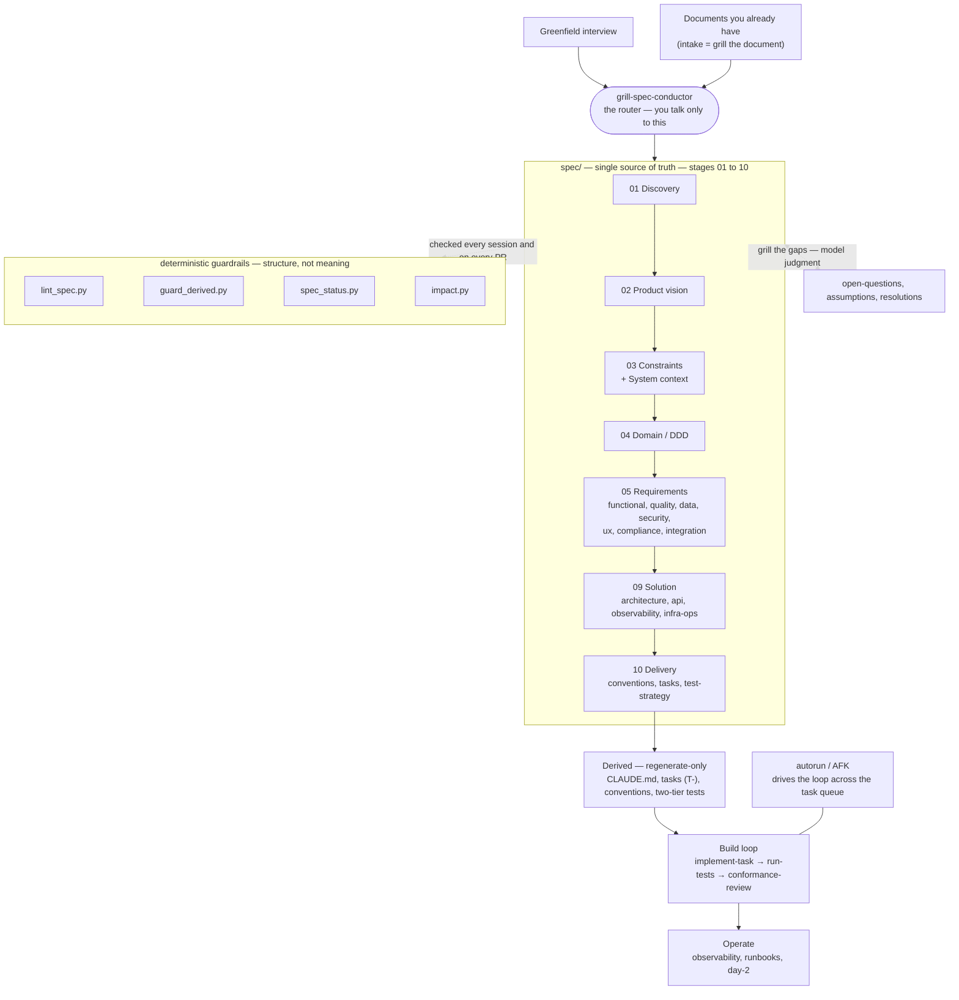

# How it works

A short guide to what this system is, how you drive it, and what each background tool does.

## In one paragraph

You describe what you want to build. The system **interviews you** — or **ingests documents you already have** — pressure-tests every answer, and writes a rigorous, cross-referenced **specification** under `spec/`. From that spec it **derives** what an agent needs to build: coding conventions, a task list, a test strategy, and a `CLAUDE.md` entry point. Then it **drives the coding**, task by task, checking each change against the spec and the architecture. Deterministic tools enforce the structure; the hard thinking — *is this requirement right? is this document actually complete?* — is the model's job, done through a set of interview "lenses."

## The one thing to know

You talk to a single skill: **`grill-spec-conductor`** (the conductor). It is the front door and the router. You never call the other 43 skills by hand — the conductor reads the state of the spec and tells you the next sensible move. Start every session by pointing Claude Code at the conductor.

## The shape of it

Solid arrows are the build flow. The two dotted backstops are the point of the whole system: deterministic guardrails that check **structure**, and the grilling lenses that resolve **meaning**.

## The pipeline, stage by stage

Each stage takes the stage(s) before it as input and produces the artifacts the next stage depends on. The conductor routes; each stage is one — or a few — concrete skills.

| Stage | Skill(s) | Takes in | Produces |
|---|---|---|---|
| 01 Discovery | `grill-problem-validation` | the idea / the bet | problem, riskiest bets, assumptions, PMF plan |
| 02 Product | `grill-product-vision` · `grill-customer-discovery` · `grill-market` · `grill-goals` | discovery | vision & phasing (MVP / near / deferred), **the GTM motion (PLG vs sales-led)**, personas, market, success metrics |
| 03 Constraints | `grill-constraints` | the idea / existing docs | technical · organizational · regulatory bounds, assumptions, dependencies |
| 03 System context | `grill-system-context` | product + constraints | external actors, neighbor systems, interfaces, the C4 System Context (L1) |
| 04 Domain (DDD) | `grill-ddd` | vision + system context | aggregates, commands, events, invariants, ubiquitous language |
| 05 Requirements | `derive-functional` · `grill-quality` · `grill-data-reqs` · `grill-security-reqs` · `grill-ux-reqs` · `grill-design-system` · `grill-compliance` · `grill-integration-reqs` · `grill-ml-reqs` (AI) | domain | use-cases + acceptance criteria (`UC-`/`AC-`), quality bars (`NFR-`/`ASR-`), data (`DATA-`), security (`SEC-`), UX journeys + a11y, the design system (`DS-`), obligations (`OBL-`), integration, ML behaviour/evals (`ML-`, AI) |
| 06 Commercial | `grill-monetization` | functional — real features to price | business model · pricing · plans · **entitlements → which features sit in which tier** · metering — **feeds 09 Solution** (entitlement enforcement, billing, metering become build work) |
| 09 Solution | `derive-architecture` · `derive-data-architecture` · `derive-api-contracts` · `derive-security-architecture` · `derive-infra-ops` · `derive-observability` · `derive-test-strategy` · `derive-ml-architecture` (AI) | requirements | architecture incl. the **module map & seam contracts** + key sequences, API / event contracts (`API-`), observability (`SLO-`), deployment & ops, the two-tier test strategy, ML serving / eval / guardrails (AI) — *module internals are designed per-slice in Build, not here* |
| 10 Delivery | `derive-conventions` · `derive-tasks` | solution | `CLAUDE.md`, the task list (`T-`), coding conventions |
| Build | `implement-task` · `run-tests` · `conformance-review`  (· `autorun` drives it AFK; a **design-first** slice first runs `derive-impl-design` for its module internals; a UI slice first runs `generate-ui-prototype` for its screen) | delivery | working code, one slice at a time: (design-first → module internals) → implement → test → conformance-review |
| Build Docs | `generate-docs` · `generate-api-reference` | the spec (any change) | a self-contained docs site (HTML) — **continuous: rebuilt in CI on every spec change**, not a one-time slot |
| Operate | `deploy-release` · `migrate-data` · `operate-incident` · `diagnose` | the running system | deploys, migrations, incident & diagnosis records, day-2 cadence |

**Parallel & cross-cutting:**

- **Go-to-market** (`grill-go-to-market`, 07) — channels · per-channel messaging · launch · partnerships: genuinely commercial *execution*. The build-shaping decision — the **motion** (PLG vs sales-led) — was lifted up into the **product vision** (02), where it feeds onboarding (UX), auth/SSO (security), and billing (monetization). A marketplace channel or a partnership can still surface an integration requirement.
- **Growth** (`grill-growth`, 08) — post-launch activation/retention + experiments; the **analytics events it defines become instrumentation tasks** in the build, so it loops back in.
- **Spikes** (`prototype`) — runnable at **any stage** to settle one empirical unknown (feasibility · perf · a UX direction), then deleted; the answer lands as a bet, a requirement, or an ADR.

## Two ways in

- **Greenfield** — the conductor interviews you area by area. Vague answers become measurable bars; every edge, error, and state is hunted down before an area is "done."
- **You already have documents** — *intake is grilling, with the document as the interviewee.* The system files your content into the right places **and** runs the same interrogation. A document that parses cleanly is not "done": every coverage gap, vague assertion, ambiguous term, open branch, and contradiction is surfaced — **silence is an unanswered question; a confident sentence is an unvalidated assumption.** Each finding is **recorded in the artifact it belongs to** — resolved, or deferred there with the trigger that reopens it — and grilled like any interview answer. See `conductor-playbook.md` for the two intake modes (single doc-first start, and migrate mode for a whole pile of docs).

## The background tools — what does what, and when

| Tool | What it does | When it runs | Verdict |
|---|---|---|---|
| `lint_spec.py` | Formal structure, consistency, and coverage: valid file paths, defined IDs, resolving references, one definition per ID, per-area ID ownership, correlated IDs (`AC-`→`UC-`, `ASR-`→`NFR-`), coverage hints, traceability currency, superseded-ADR-referenced-as-live, and blocked-task-without-a-human-ask | Every session, and on every pull request (`spec-governance.yml`) | Deterministic pass/fail — an `ERROR` blocks |
| `guard_derived.py` | A pre-commit hook that **blocks hand-edits to generated files** (`solution/*`, `requirements/functional/`, `delivery/conventions`+`tasks/`, root `CLAUDE.md`). To change one, you edit its upstream and re-derive | Pre-commit, and in CI | Blocks the commit |
| `impact.py` | **Change propagation.** Given the IDs you changed — or `--since <gitref>` to self-detect from the git diff — it prints the minimal set of downstream artifacts and the impacted code to re-derive and re-test | Whenever you change the spec | Informational list |
| `spec_status.py` | **Mechanical readiness rollup.** Element counts, the share of use-cases that carry an acceptance criterion, tasks (afk-eligible vs blocked), open questions, traceability presence, and a blockers verdict | Run anytime to gauge completeness | Informational only — it does **not** judge whether the content is right |

Behind the skills sit three shared engines: `grill-engine.md` (the interview discipline every `grill-*` skill loads), `derive-engine.md` (the generation discipline every `derive-*` skill loads), and `exec-engine.md` (the build/verify discipline every execution skill loads). The walking-skeleton task and the derive-* skills **generate three GitHub Actions into your project**, ready to run: `spec-governance.yml` (the framework's `lint_spec.py` + `guard_derived.py` on PRs), `code-ci.yml` (the application's own build / test / conformance pipeline), and `docs-site.yml` (the generated documentation site). They are produced into your repo, not shipped as files in this plugin.

## Deterministic vs. model judgment — read this once

The tools enforce **structure**. They cannot tell you whether a requirement is *correct*, whether a document is *actually complete*, or whether two sentences *mean* the same thing — that is model judgment, done by the grilling lenses. **A clean linter on a spec nobody interrogated means nothing.** Both layers are load-bearing: structure keeps the spec well-formed, the lenses keep it true.

## Where things live

- `spec/` — the specification, stage-numbered `01-discovery` … `10-delivery`. The single source of truth.
- `adr/` — every Architecture Decision Record, **one file per ADR**, named `ADR-<AREA>-NNN.md` (the area prefix stops two skills colliding); the conductor derives a global ADR index from it.
- **No side-ledger files** — there is no `open-questions.md`, `assumptions.md`, or `resolutions.md`. An open point is resolved into its artifact, **deferred in the artifact** with the trigger that reopens it, or — if it's a deliberate choice — captured as an ADR. `glossary.md` and `actors.md` are **per-area deliverables**; the conductor reconciles a system-wide view at the spec root.
- `_human-input.md` (spec root) — the **one operational queue**: the batched human-in-the-loop asks `autorun` parks for you to clear in a sitting. Maintained by the orchestration loop; it's a handoff queue, not a decision ledger.
- `src/` + `tests/` — code, and nothing else.
- **Regenerate-only** (never hand-edited; the guard blocks it): `solution/*`, `requirements/functional/`, `delivery/conventions`+`tasks/`, and the root `CLAUDE.md`.

## Driving it — the loop

1. Run the conductor. It reports where the spec stands and the next move.
2. Answer its questions, or ratify the default it proposes. It records as it goes and **propagates** every change automatically.
3. An unknown is **resolved into its artifact or deferred there** (with the trigger that reopens it); a risky guess is recorded as an **assumption with a status, beside what it supports** — or an ADR if load-bearing. Nothing is silently assumed, and there is no separate ledger file.
4. When the spec is ready it derives conventions, tasks, and tests, then drives the build: `implement-task → run-tests → conformance-review`, one task at a time.
5. **AFK / autorun** runs that loop across the whole task queue on its own, stopping only on a true human-in-the-loop trigger: a visual / UX call, a product or strategy decision, a legal sign-off, an external credential, or an irreducible preference fork.
