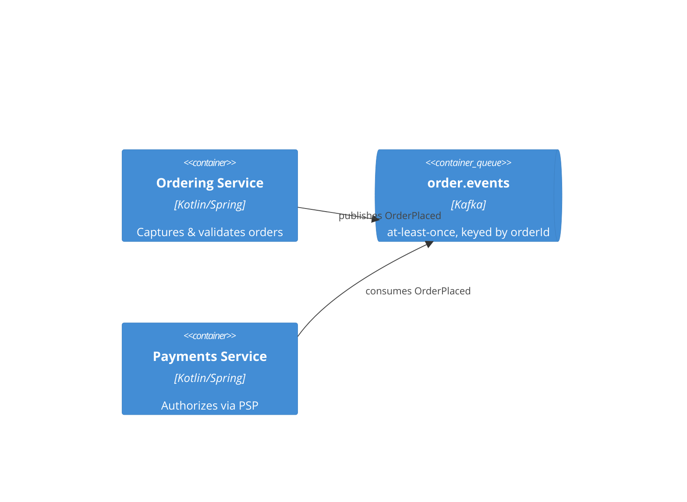

# derive-architecture — worked example

**Upstream (settled):** "Order capture must stay up if Payments is down" → `ASR-003` (availability, capture path); contexts **Ordering**, **Payments**, **Inventory** from the domain model.

A fork decided on merit (not asked): Ordering↔Payments is **async** — capture must survive a Payments outage, so a synchronous call would couple their availability. Recorded as `ADR-ARCH-004`; its **consequence** records the residual risk — at-least-once delivery can double-charge — mitigated by an idempotent consumer keyed on `orderId` (the mitigation lives in the design, not a separate risk log).

C4 container slice (`c4.md`):

Module map (`modules.md`) — the **seam contracts** independent slices integrate against (internals are **not** designed here):

| Module | Role | Dep direction | Seam interface |
|---|---|---|---|
| Ordering | domain | inward only (no infra deps) | `placeOrder(cmd) → OrderId` · emits `OrderPlaced` |
| PaymentsGateway | driven-port | domain depends on the port, not the adapter | `authorize(orderId, amount) → AuthResult` |
| OrderEventsPublisher | adapter | implements a driven-port | publishes to `order.events` (keyed by orderId) |

ASR → tactic → location → fitness function (`quality.md`):

| ASR | Tactic | C4 location | Fitness function |
|---|---|---|---|
| ASR-003 | Bulkhead + async hand-off (capture never blocks on Payments) | Ordering→`order.events`→Payments | Chaos test kills Payments; capture p99 stays <300 ms, 0 dropped orders (CI gate) |

Key sequence (`sequences.md`) — the critical-failure path: Payments down at capture time → order is still placed, `OrderPlaced` is queued, authorization is retried on recovery (idempotent by `orderId`).

Recorded: style (event-driven + per-context services), the async ADR **with its double-charge risk as the ADR consequence**, the module map + seam contracts (what slices build against), the tactic + fitness function for `ASR-003`, the critical-failure sequence. Every context placed; the seams are fixed — an agent could build the capture path with no further architectural decision, and **module internals are left to per-slice JIT design**.
