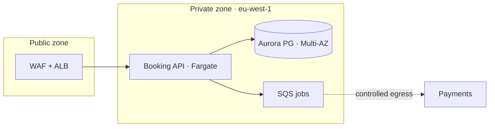

# derive-infra-ops — worked example

From the NFRs: *"99.9% availability, RTO 15 min / RPO 5 min for the booking store; EU-only data residency; serverless-leaning stack."* That recorded input drives the deploy & operations architecture below.

**Topology** (`topology.md`) — three env tiers, EU-pinned, segmented:

dev / stage / prod are the same module, region-pinned `eu-west-1`; config-in-environment, immutable artifacts.

**IaC** (`iac.md`): Terraform; one module reused across dev/stage/prod with per-env tfvars; remote state in an S3 backend with state locking — no console drift.

**CI/CD stage** (`cicd.md`) — on merge to `main`:
> deploy app → **dev environment** → run e2e/integration pipeline → **canary** release (10% → 100%). Promotion signal: error-budget burn-rate < 2× over the 1h window; abort/rollback if exceeded. Feature flags decouple deploy from release.
> (on-MR: build · full test suite · conformance · gates incl. **SLSA** provenance/signing — green before merge.)

**Delivery-metric target** (`delivery-metrics.md`):

| metric | target | instrumentation |
|---|---|---|
| change-failure rate | < 15% | deploy events ⨯ incident tags in the pipeline ledger |

*(deployment frequency · change lead time · failed-deployment recovery time are set + instrumented the same way.)*

**DR tier** (`scaling-dr.md`) — for the RTO 15 / RPO 5 booking store:
> **warm-standby** in `eu-central-1` (Aurora cross-region replica, 5-min lag = RPO; promote + DNS cutover ≤ 15 min = RTO). Failover-runbook owner: **Platform on-call**. Day-2: quarterly DR drill + test-restore.

**Cost practice** (`cost.md`): allocate by tag `team`+`env`+`tenant`; unit-cost = **$ / 1k bookings**; levers = Fargate right-sizing · 1-yr Savings Plans · Spot for async workers; anomaly alert > 20% WoW; monthly per-tenant showback; `eu-west-1` chosen partly on carbon intensity.

**Human-only prerequisites** (`prerequisites.md`) — **names + locations, never values** — front-loaded by the walking-skeleton bootstrap:
- AWS account + billing alarm + service quotas (Fargate vCPU · Aurora ACUs)
- secret **names** + where set: `PAYMENTS_API_KEY` (CI + platform secret store) · `DB_MASTER` (IaC backend)
- OAuth/app registration for SSO (IdP console)
- DNS: `api.example.com` A/AAAA + ACM validation records
- residency choice: `eu-west-1` (account-gated)

Recorded: each availability/RTO/RPO NFR → a mechanism + DR tier; flags decouple deploy from release; the rollout names a burn-rate promotion/abort signal; cost as a *practice*, not a number; the human prerequisites enumerated as names for the bootstrap.
