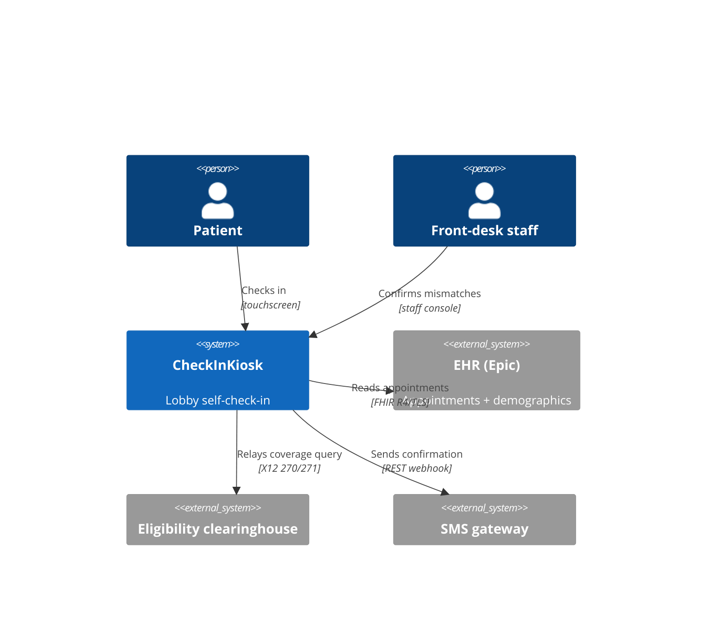

# grill-system-context — worked example

Scope of a clinic's patient check-in kiosk, before any internals are drawn.
> **Claude:** When the kiosk verifies a patient's insurance, does *our* system decide eligibility, or does it just relay an answer from the payer's clearinghouse? *(I'd put eligibility outside the boundary — we ask, they rule.)*
> **User:** We relay. The clearinghouse rules; we just show the result.
> **Claude:** Then the clearinghouse is a neighbor, not part of us. Does the kiosk ever write back to the EHR, or only read appointments from it?
> **User:** Read-only on appointments. Demographic edits go to the EHR, but a staff member confirms them — not the kiosk.

## Output — `scope.md`
**System:** CheckInKiosk · **Purpose:** let an arriving patient self-confirm identity, appointment, and coverage at a lobby terminal.
- **IN:** identity match, appointment lookup display, coverage-check relay, queue-position assignment.
- **OUT:** eligibility *adjudication* (payer owns it), demographic *writes* to the record, clinical content, payment capture.

## Output — `actors.md`
| Actor | Type | Role at boundary |
|---|---|---|
| Patient | human | self-checks in at the terminal |
| Front-desk staff | human | confirms flagged demographic mismatches |
| EHR (Epic) | system | source of appointments + demographics (read) |
| Eligibility clearinghouse | system | rules on coverage; we relay |
| SMS gateway | system | sends "you're checked in" confirmation |

## Output — `interfaces.md`
| Neighbor | Direction | What flows (business) | Channel (technical) | Trigger |
|---|---|---|---|---|
| EHR (Epic) | in | today's appointments, patient demographics | FHIR R4 REST over TLS | patient enters DOB+last-name |
| Clearinghouse | bi | coverage query → eligibility answer | X12 270/271 via vendor API | identity matched |
| SMS gateway | out | check-in confirmation | REST webhook | queue position assigned |

## Output — `context-diagram.md`

Recorded: one black box (CheckInKiosk); 5 boundary elements, none orphaned; each interface split business vs technical context; eligibility adjudication + demographic writes pushed OUT of the system boundary. No C4/architecture jargon spoken to the user.
